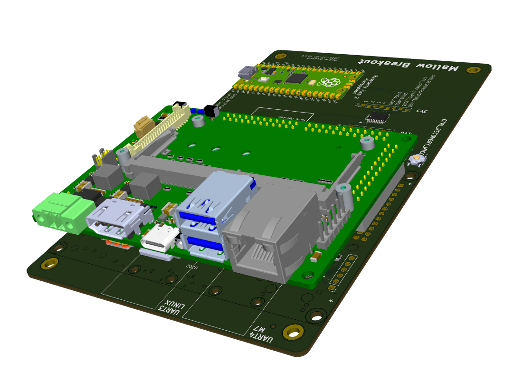
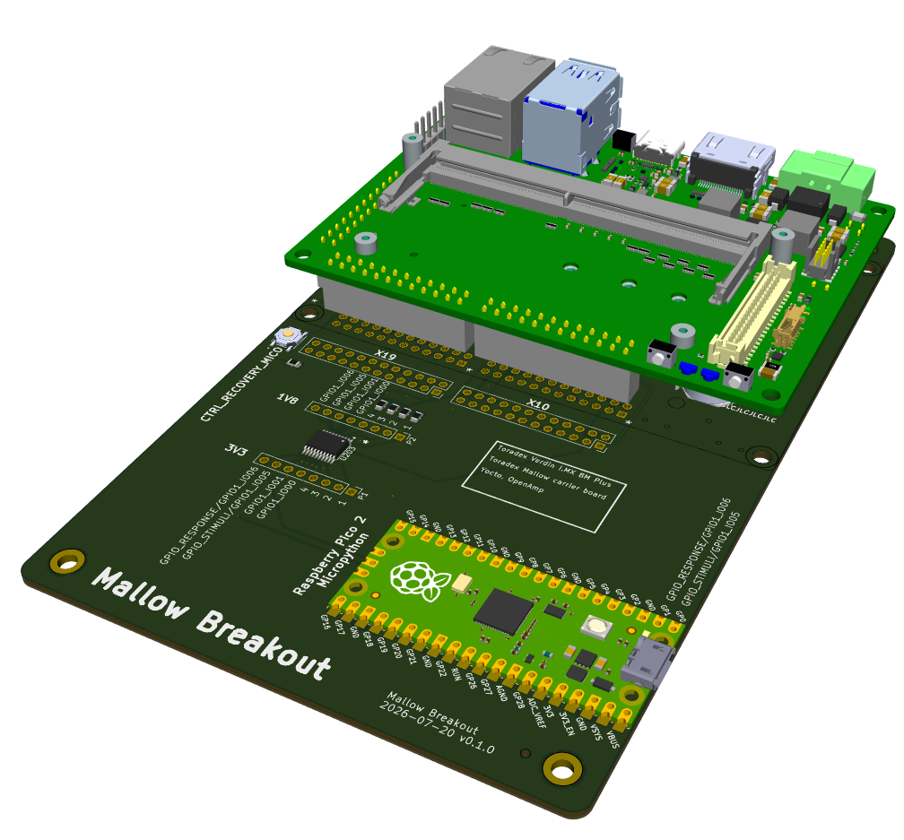
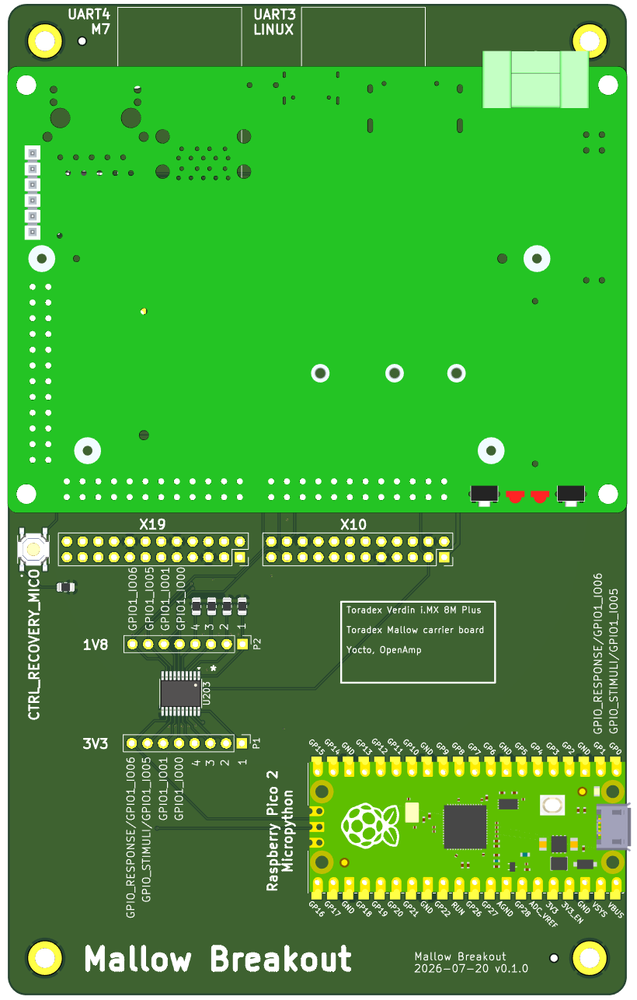

# Hardware - Overview

## References

* [Toradex Verdin i.MX 8M Plus](https://www.toradex.com/de/computer-on-modules/verdin-arm-family/nxp-imx-8m-plus)
* [Toradex Mallow carrier board](https://www.toradex.com/products/carrier-board/mallow-carrier-board)

  * [Datasheet](https://docs.toradex.com/113873-mallow-carrier-board-datasheet.pdf)

## Mallow Breakout Board

## BOM

| CHF | Distributor/Link | Product | Notes |
| -: | :-: | - | - |
| 249 | [toradex](https://www.toradex.com/de/computer-on-modules/verdin-arm-family/nxp-imx-8m-plus) | 00631102 Verdin iMX8M Plus Quad 4GB IT V1.1C | - |
| 83 | [toradex](https://www.toradex.com/de/products/carrier-board/mallow-carrier-board) | 01611102 Mallow Carrier Board V1.1C | - |
| 11 | [toradex](https://www.toradex.com/de/accessories/verdin-industrial-heatsink) | 23111100 Verdin Industrial Heatsink Type 1 V1.1A | - |
| 25+29 | toradex | Freight+MWST | - |
| 29 | [distrelec](https://ftdichip.com/products/ttl-232rg-vreg1v8-we/) | TTL-232RG-VREG1V8-WE USB-TTL SERIAL CABLE | 1.8V !!! |
| 26 | [distrelec](https://www.st.com/en/evaluation-tools/nucleo-f722ze.html) | NUCLEO-F722ZE STM32 Nucleo-144 development board | [STM32F722ZET6](https://www.st.com/resource/en/datasheet/stm32f722ic.pdf) 216 MHz |
| 50 | digitec | [Delock 95272](https://www.delock.de/produkt/95272/merkmale.html) | See [README_hardware_30_second_ETH](README_hardware_30_second_ETH)|